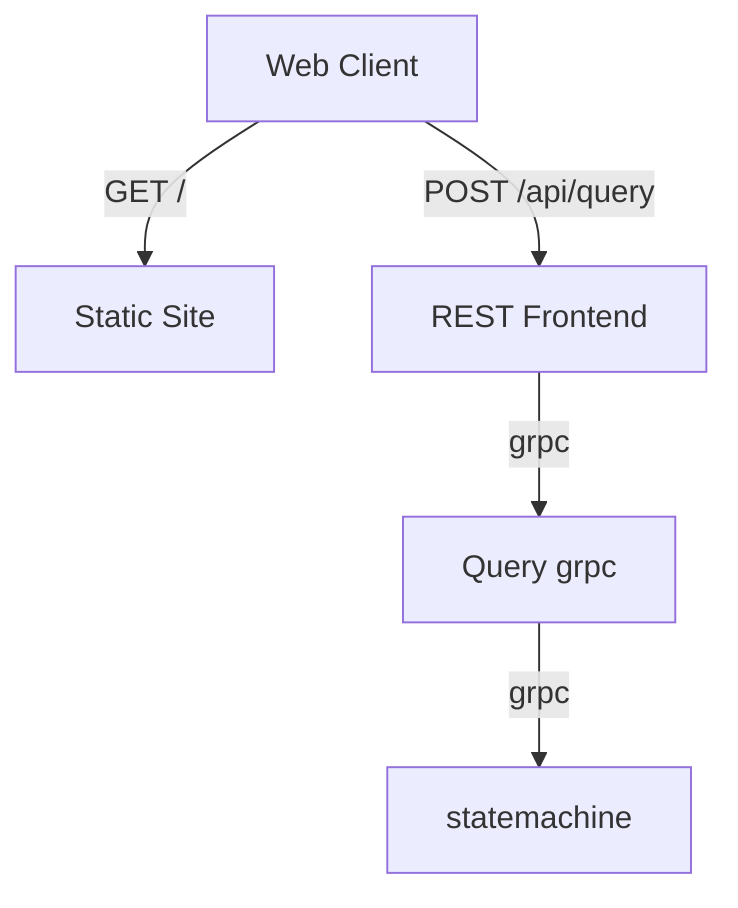

# Statemachine



## Docker Compose
Docker compose spins up the static site in nginx as well as jaeger for tracing.
```bash
docker compose up --build -d
```

## API
```bash
cargo run --bin web_api
```

## Statemachine
```bash
cargo run --bin statemachine
```

## TODO
```bash
cargo run --bin emulator
```